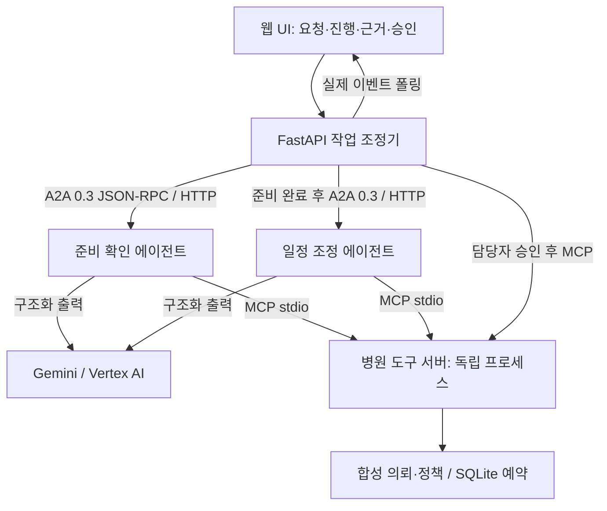

# ExamFlow

**검사 예약의 행정 준비 확인과 일정 조정을 수행하는 멀티 에이전트 데모**

검사 예약 담당자가 의뢰서 접수 상태와 검사실 시간을 따로 확인하는 흐름을 하나의 화면으로 연결했습니다. 준비 확인 에이전트가 행정 서류와 요청 조건을 해석하고, 일정 조정 에이전트가 가능한 시간을 제안합니다. 담당자가 승인하면 서버가 충돌과 중복을 확인해 합성 예약을 기록합니다.

## 바로 확인하기

- [공개 저장소](https://github.com/sbj1229/examflow)
- [라이브 데모 — Cloud Run](https://examflow-922216333816.asia-northeast3.run.app)
- [5분 발표 PPTX](deliverables/ExamFlow_발표본.pptx) · [개발 회고](deliverables/ExamFlow_회고본.md)
- [검증 기록](docs/verification.md) · [설계 결정](docs/decisions.md) · [배포 구성](docs/deployment.md)
- [요구사항 대응 및 최종 검토](docs/review.md) · [배포 구성](docs/deployment.md)
- [과제 요구사항에 대한 질문과 구현 답변](docs/assignment-answers.md)

## 예약 운영 화면

상단 **예약 현황 · 시간표** 메뉴에서 확정·취소 예약과 검사실 가용 시간을 확인합니다. 시간 추가, 운영일·시간·검사실 수정, 접수 중지·재개, 예약 취소가 가능합니다. 예약된 시간은 취소 후 수정하며 취소 이력에는 당시 시간을 보존합니다. 시간표 변경은 MCP 조회와 다음 제안에 반영되고, 조회 후 수정된 예약안은 버전 검사로 승인을 차단합니다.

**에이전트 협업**에서는 조정기·준비 확인·일정 조정·MCP 서버·저장소 구조를 봅니다. A2A HTTP 실선과 MCP stdio 점선을 구분하고, 구성 요소별 설명·호출 방향·입력·응답을 확인합니다. 전체 통신 기록은 펼쳐 볼 수 있습니다.

관리 데이터는 같은 브라우저 세션에서 새로고침 후 다시 읽습니다. 다른 브라우저와 공동 운영하는 계정 기능, 서버 재시작 후 영구 보존은 현재 제공하지 않습니다.

## 시연 흐름

1. **EX-1001 / 오후 예약 요청**: 서류 접수 완료 → 오후 가용 시간 선택 → 담당자 승인 → 데모 예약 확정.
2. **EX-1002 / 서류 누락**: 연락처 확인과 사전 확인표 접수 누락 → `needs_input` → 일정 조회 중단.
3. **EX-1003 / 빈 후보**: 서류 확인 완료 → 가용 시간 없음 → `no_slots`.
4. **충돌 검증은 API 테스트로 확인**: 같은 HTTP 세션에서 같은 오후 시간의 예약안 두 개를 먼저 만든 뒤 차례로 승인합니다. 첫 요청은 confirmed, 두 번째는 conflict입니다. `python -m pytest -q tests/test_system.py -k conflicting_proposals`로 재현합니다. 첫 예약을 확정한 뒤 새로 조회하면 no_slots가 될 수 있으므로 이 순서와 구분합니다.

각 시연은 브라우저 세션별 합성 예약 공간을 사용합니다. 다른 사용자의 데모 예약에 영향을 주지 않습니다. 기존 예약을 유지한 채 새 의뢰를 생성하는 기능은 범위에 포함하지 않았습니다. 새 브라우저 세션에서 기본 사례를 다시 시연할 수 있습니다.

## 아키텍처



Cloud Run 컨테이너 하나에 웹 서버와 A2A 서버를 함께 실행합니다. 에이전트 호출은 함수 호출로 대체하지 않고 loopback HTTP를 사용합니다. MCP 서버는 각 에이전트 작업에서 독립 자식 프로세스로 실행하며 공식 클라이언트로 initialize 및 tools/call을 수행합니다. 배포 단위를 줄인 데모 구성이며 서비스 간 독립 배포를 완료했다고 주장하지 않습니다.

### 에이전트 책임

| 역할 | 모델이 수행하는 일 | 코드로 보장하는 경계 |
|---|---|---|
| 준비 확인 | 요청의 시간 선호 추출, 행정 접수 근거 요약 | 필수 필드 누락과 ready 결과를 원본과 대조 |
| 일정 조정 | 선호 조건에 맞는 조회 후보 선택과 설명 | 반환 slot_id가 허용된 후보에 속하는지 검증 |
| 조정기·승인 API | 모델을 사용하지 않음 | 상태 전이, 세션 소유권, 사용자 승인, 시간 만료 |
| 예약 도구 | 모델을 사용하지 않음 | 검사 종류 대조, 서류 재확인, DB 유일성 제약 |

### A2A 계약

- 공식 `a2a-sdk==0.3.26`, 프로토콜 0.3 JSON-RPC, `message/send`.
- Agent Card: `/a2a/readiness/.well-known/agent-card.json`, `/a2a/scheduling/.well-known/agent-card.json`.
- 입력: `AgentJob` JSON을 TextPart로 전달. 결과: Task Artifact의 DataPart.
- 상태: `submitted → working → completed / input-required / failed`.
- 실제 호출 이벤트에 전송 방향, 메서드, Task ID, 반환 상태를 기록합니다. 모델의 비공개 추론을 노출하는 화면이 아닙니다.
- 작업 수행 엔드포인트는 내부 헤더 인증을 요구합니다. 공개 URL에서 직접 임의 A2A 작업을 실행할 수 없습니다. 카드 조회만 공개합니다.

### MCP 도구

| 도구 | 용도 |
|---|---|
| `get_order` | 합성 검사 의뢰의 접수 상태 조회 |
| `get_preparation_policy` | 버전이 있는 행정 규칙 조회 |
| `find_slots` | 세션별 가용 시간 조회 |
| `reserve_demo_slot` | 승인 후 합성 예약 기록, 중복 및 충돌 처리 |

쓰기 도구는 LLM 도구 목록으로 직접 노출하지 않습니다. 승인 API가 상태·세션·버전을 확인한 후 호출합니다. MCP stdio 서버 자체를 직접 실행할 수 있는 개발자는 신뢰 경계 내부입니다.

## 로컬 실행

Python 3.12 기준입니다. Windows PowerShell:

```powershell
python -m venv .venv
.\.venv\Scripts\python.exe -m pip install -r requirements-dev.txt
$env:MODEL_MODE="fixture"
.\.venv\Scripts\python.exe -m uvicorn app.main:app --host 127.0.0.1 --port 8080
```

Linux/macOS:

```bash
python3.12 -m venv .venv
.venv/bin/python -m pip install -r requirements-dev.txt
MODEL_MODE=fixture .venv/bin/python -m uvicorn app.main:app --host 127.0.0.1 --port 8080
```

`http://127.0.0.1:8080`을 엽니다. `.env.example`은 설정 예시이며 자동으로 로드되지 않습니다. 셸 환경변수나 `uvicorn --env-file .env`로 명시해서 사용하세요.

### 실제 Gemini

Vertex AI를 활성화한 프로젝트에서 ADC 인증 후 `MODEL_MODE=gemini`, `GOOGLE_CLOUD_PROJECT`, `GOOGLE_CLOUD_LOCATION=global`을 설정합니다. Cloud Run에서는 전용 서비스 계정의 기본 인증을 사용합니다. API 키 방식은 `GOOGLE_CLOUD_PROJECT`를 비운 상태에서 `GEMINI_API_KEY`를 설정합니다. 비밀정보를 소스·이미지·발표자료에 넣지 않습니다.

| 환경변수 | 기본값 / 의미 |
|---|---|
| `MODEL_MODE` | `fixture` / `gemini`. fixture는 규칙 기반이며 실제 모델 미호출 |
| `GEMINI_MODEL` | `gemini-2.5-flash` |
| `GOOGLE_CLOUD_PROJECT` | Vertex AI 프로젝트 |
| `GOOGLE_CLOUD_LOCATION` | `global` |
| `PORT` | `8080`. uvicorn 포트와 일치 필요 |
| `EXAMFLOW_DB` | 로컬 `.tmp/examflow.db`, 컨테이너 `/tmp/examflow/data.db` |
| `DAILY_MODEL_CALL_LIMIT` | `120`. 인스턴스 로컬 DB에 기록하는 UTC 일별 한도 |
| `INTERNAL_SECRET` | 미설정 시 프로세스 시작 때 생성. 내부 A2A 인증·세션 서명 |
| `COOKIE_SECURE` | 로컬 `false`, HTTPS 배포 `true` |
| `PUBLIC_BASE_URL` | Agent Card에 표시할 공개 서비스 URL |

## 검증

Python 자동 테스트 25개와 JavaScript 비동기 회귀 검사 3개를 통과했습니다. 서로 다른 범위이며 실제 모델 검증과 합산하지 않습니다. 공개 배포에서는 실제 Gemini로 정상 예약·중복 승인·서류 누락·가용 시간 없음·세션 격리·A2A 접근 경계를 검증했습니다. `python scripts/verify_deployment.py --base-url <서비스 URL>`로 배포 검증을 재실행할 수 있으며 실제 모델 호출 비용이 발생합니다.

```bash
python -m pytest -q tests --junitxml=.tmp/test-results.xml
node --test tests/test_ui.cjs
python skills/examflow/scripts/invoke.py --order EX-1002 --state-file .tmp/missing-case.json
```

로컬 실제 모델 검증은 표준 ADC 인증 후 `python scripts/live_smoke.py --project <본인 프로젝트 ID>`로 실행합니다. 포트 8082를 사용하며 생성된 서버는 검증 종료 시 정리합니다. 개인 임시 SDK 경로를 요구하지 않습니다. API 키를 쓰는 경우 GOOGLE_CLOUD_PROJECT를 비우고 GEMINI_API_KEY를 환경변수로 설정합니다.

자동 테스트는 별도 포트 8081에서 서버를 띄우며 실제 A2A HTTP와 MCP stdio를 통과합니다. 모델은 fixture로 고정합니다. 모델 경계 검증에서는 의도적으로 잘못된 구조화 결과를 주입합니다. 실제 Gemini 호출 검증 결과는 [검증 기록](docs/verification.md)에서 별도로 확인합니다.

## Docker와 GCP

```bash
docker build -t examflow .
docker run --rm -p 8080:8080 -e MODEL_MODE=fixture examflow
```

Cloud Build용 `cloudbuild.yaml`과 Dockerfile을 제공합니다. Linux 컨테이너에서는 비루트 사용자로 실행합니다. 소스 업로드에서 `.tmp`, `.venv`, `.env`, 인증 파일을 제외합니다. [배포 기록과 실행 명령](docs/deployment.md)을 참조하세요.

## Antigravity 스킬

`skills/examflow/SKILL.md`와 호출 스크립트를 제공합니다. 패키지를 `.agents/skills/examflow/`에 복사하면 Antigravity의 프로젝트 스킬 검색 위치에 놓을 수 있습니다. 원본 패키지 위치에서도 스크립트를 직접 실행할 수 있습니다.

```bash
python skills/examflow/scripts/invoke.py --order EX-1001 --request "오후 예약" --state-file .tmp/proposal.json
# 출력된 의뢰·시간·근거를 확인하고 승인한 뒤 동일 실행을 확정
python skills/examflow/scripts/invoke.py --resume --approve --state-file .tmp/proposal.json
```

스크립트는 상태 파일에 세션과 실행 번호를 보관해 호출을 나눠도 동일 예약안을 유지합니다. 상태 파일의 쿠키는 비공개로 보관합니다. 새 요청은 새 파일 이름을 사용합니다. `--approve`는 --resume과 함께, 사용자가 제시된 예약안을 승인한 경우에만 사용합니다. 원격 서비스에는 두 명령 모두 동일한 --base-url을 추가합니다. [Antigravity 호출 예시](docs/assignment-answers.md#antigravity-시연)를 참고하세요.

## 데모 동작 참고

- 요청과 A2A Task는 메모리, 예약과 모델 호출 카운터는 인스턴스 로컬 SQLite에 저장합니다.
- 세션당 시간당 20개 요청, 동시 실행 4개, 보관 실행 200개로 제한합니다.
- 모델 형식 오류는 1회 재시도하며 원본과 다른 `ready` 또는 후보 밖 `slot_id`는 실패로 처리합니다.
